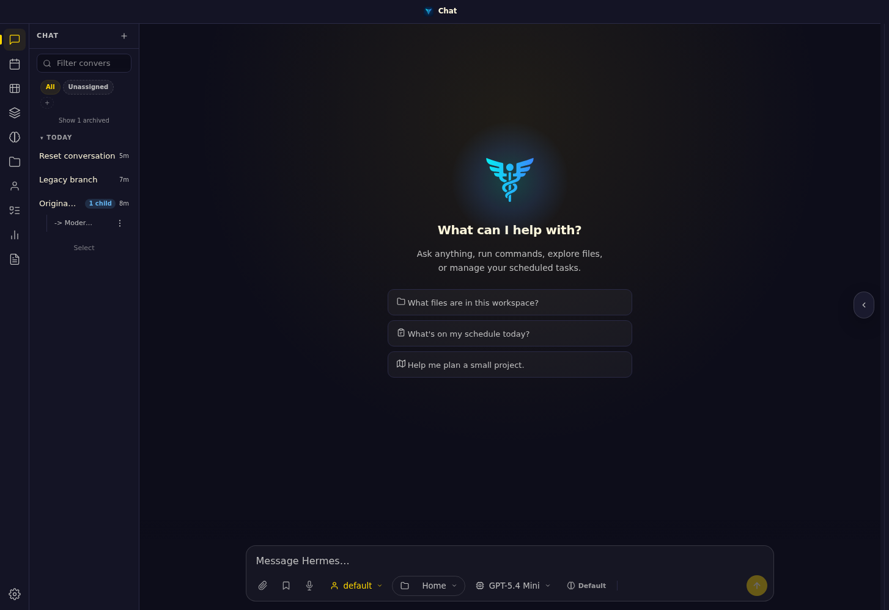
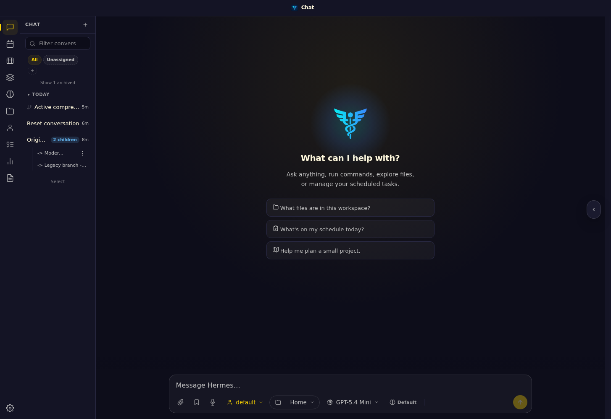
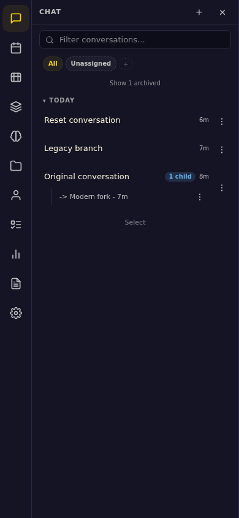
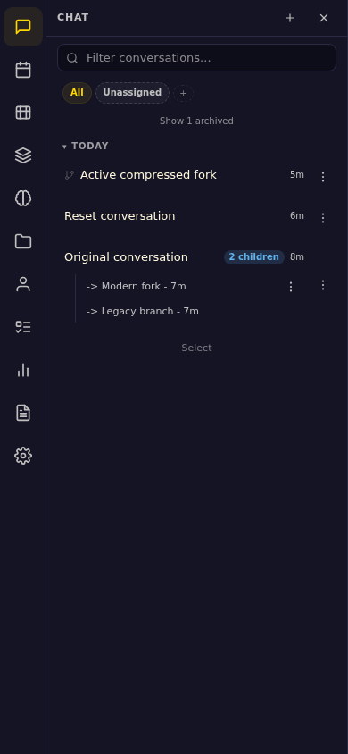

# PR #7179 review evidence

Compared contributor head `66ef9baef25ea5b88f52a7329da74bd4138d24e5` with
`efbde454` using separate WebUI servers and isolated synthetic session stores.
The screenshots load each server's real `/api/sessions` response and production
JavaScript/CSS in Chromium. No provider call or real user session is involved.

| Viewport | Before | After |
| --- | --- | --- |
| Desktop, 1440 × 1000 |  |  |
| Mobile drawer, 390 × 844 |  |  |

Before: the legacy branch appears as a separate reset conversation; its parent
shows only the modern fork as one child. The active compressed fork is missing.
After: the original conversation contains both branches (two children), the
reset conversation remains top-level, and the active compressed fork is visible.
No uncaught JavaScript exception occurred in any of the four browser runs.

## Automated verification

- 244 affected tests passed: gateway sync, lineage API metadata, lineage reports,
  frontend grouping/navigation, and state.db reconciliation.
- 143 neighboring tests passed: lineage performance/caps, readonly database
  access and descriptor lifetime, import/cache behavior, compression snapshots,
  pin visibility, and context reconciliation.
- Transplanting the final regressions onto `66ef9ba` produced 39 expected failures
  and one passing ordinary-WebUI compression control.
- Python compileall, Node syntax check, `git diff --check`, and the Ruff diff gate
  passed; Ruff reported no new violations, including across the full PR diff.

The full repository suite and maintainer's private gate were not run locally.
These screenshots use seeded data; no live Agent `/branch` or `/reset` command
was executed. The tests bind to the timestamp ordering and session shapes from
the maintainer's reproduced findings.
